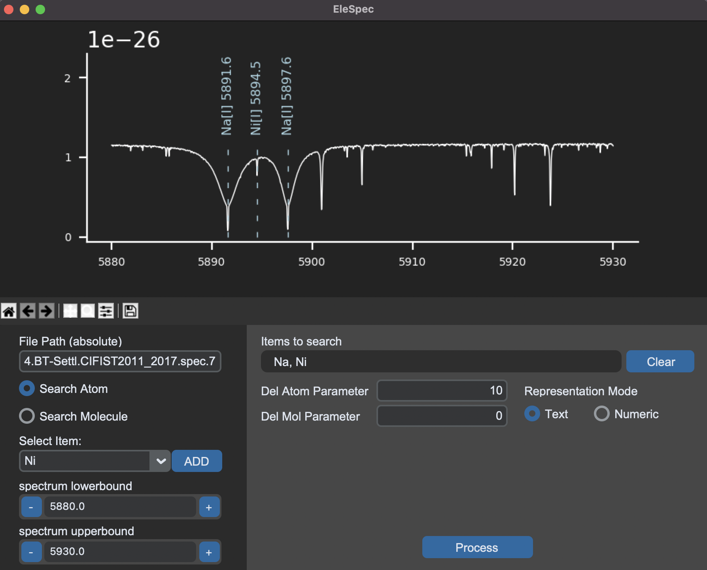

# EleSpec - tool for accurate detection of elements and molecules in spectral data


***
#### Using GUI Interface

###### Load GUI (make sure requirements.txt are installed if not run `pip install -r requirements.txt`)
```python
python3 gui.py
```
***
Using through Terminal
```python
python3 detect.py --help
```

```
positional arguments:
  file             data file
  ele              element or list of elements to plot
  xmin             minimum wavelength to plot
  xmax             maximum wavelength to plot
  flag             0: print numeric identification, 1: print text
                   identification, 2: print text form element number for
                   atomic lines and ifacod for moleciular lines
  molflg           0: do not plot molecular lines, 1: plot molecular lines
  delatom          parameter for atom print threshold, gives difference between iml and icnt for lines to plot
  delmol           parameter for molecular print threshold, gives difference between imm and iext for lines to plot

options:
  -h, --help       show this help message and exit
  --excode EXCODE  molecular codes (FA) to exclude from plotting
  --exlin EXLIN    molecular line sets (uselin codes) to exclude from plotting
  -p               print all of the elements in the spectrum

```
example

```python
python3 detect.py '/Users/rushirajgadhvi/Desktop/idl/Na_594_lte040-4.80-1.4a+0.4.BT-Settl.CIFIST2011_2017.spec.7' Na Ni 5880 5930 1 0 10 0
```
***

Some Upcoming Features - 
- Atom segmentation through ion stages
- Capability to simultaneously search for both atoms and molecules
- Support of multiple file formats